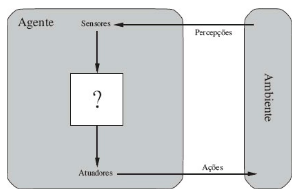

# AI concepts
 - PT/BR

## Environments (Ambiente)

* **Completamente Observável** vs **Parcialmente Observável**
* **Agente único** vs **MultiAgente**
* **Deterministico** vs **estocástico**
* **Episódico** vs **Sequencial**
* **Estático** vs **Dinâmico**
* **Discreto** vs **Contínuo**
* **Conhecido** vs **Desconhecido**

## Agents

* Agentes reativos simples
* Agentes reativos baseados em modelos
* Agentes baseados em objetivos
* Agentes baseados na utilidade
* Agentes com aprendizagem

*Todos os agentes podem melhorar seu desempenho por meio do aprendizado*

## References

*RUSSELL, Stuart; NORVIG, Peter. Artificial Intelligence: A Modern Approach. 1ª ed. São Francisco: Pearson, 2013.*