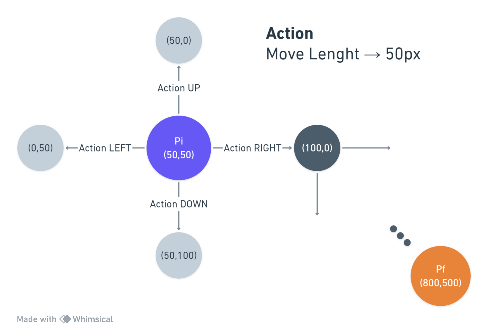

# How to create your problem for A*

[pt/br]
Para criar seu problema vai ser necessário especificar o seu problema.

## Position Problem

* **Objetivo / *Objective*:** Foi escolhido um problema um pouco audacioso, pois, o objetivo é chegar do ponto inicial ao final num espaço aberto e sem restrição de borda.

O problema é mover um jogador de uma posição inicial, $P_i$, até uma final, $P_f$, através de ações de movimento(UP, DOWN, LEFT, RIGHT).

### How to make?

1. Criar um **Estado** que abstraia o seu problema, implementando a interface **State**. [State & StatePosition](###-State-&-StatePosition)
    > Neste problema criei um **StatePosition** para representar um `State<Position>`. A ideia é abstrair o posição, cada State vai conter um Position

2. Criar uma **Ação** que abstraia uma ação do seu problema, implementando a interface **Action**.
    > Neste problema foi criado um **MovimentAction** para representar um `Action<Position>`. A ideia é uma ação de movimento com um 'passo'/ 'tamanho' $n$ unidades em pixel na tela.

    > **Obs:** Actions sempre tem **custo**, neste exemplo a ação de se mover tem custo uniforme.



#### Applying
Agora temos que aplicar o **State** e **Action** específicos de alguma forma que possamos passar para o buscador achar um **Plan**, plano de ações baseado em **Node**.

1. Neste problema específico defino as **Position** inicial (*initial*) e final (*target*) no método da classe que constroi o jogo [Interface de Game](###-Game-Interface).

```cpp
void AiTest::Init()
    //...
    Position initial(100, 100);
    Player* player = new Player(imgPlayer, initial);
    Position target (800, 500);
    player->SetTarget(target);

    scene->Add(player, MOVING);
    //...
```

> Em Inteligência Artificial (*AI*) o problema de Agente e Ambiete (*Agent and Environment*)  temos que definir um agente, nesse caso vai ser o nosso **Player**.

2. Em **Player** condensei tudo que o player pode fazer. [Player & Object interface](###-Object-Interface-&-Player)

   *  *Input* `Key_R`: Fazer a busca da posição atual ao target
   *  *Input* `SPACE`: Fazer um passo no plano

> Nesta aplicação foi criada um método **Search** que vai condensar toda a ideia de busca de posição.
```cpp
//Player.cpp
void Player::Update() {
	if (input->KeyPress(KEY_R)) {
        Search();    // <---=
        pivot = path;
        //...
	}
    //...
```
> Em **Search** Crio os **StatePosition** incial e final e jogo para o método de busca **HeuristicSearch**.
```cpp
void Player::Search() {
    StatePosition* A = new StatePosition(this->GetPosition());
    StatePosition* B = new StatePosition(target);
   // Node* path
   //...
    path = SearchMethods<Position>::HeuristicSearch(A, B, actions, dictionary);
   //...
}
```
> **HeuristicSearch** é um método baseado no algoritmo **A*** (*A Star*), onde apartir Estado inicial **gero** as transições para outros estados apartir das ações. E para reduzir o espaço de busca, a geração ocorre somente nos estados que saem da borda (*Edge*) (Fila de Prioridade que utiliza a **Heuristica** como base)

```cpp
static Node<T>* HeuristicSearch(State<T>* _initial, State<T>* _final, vector<Action<T>*> actions, Dictionary<T>* controlGenerated);
```

3. Criar uma **Heuristica** para o **StatePosition**.

> Neste código a **Heuristica** foi pegar a posição do estado atual e verificar a distância para o Estado Objetivo usando os método da classe **Position**. [Position methods](###-Position)

```cpp
//StatePosition.cpp
float StatePosition::GetHeuristic(State<Position>* _target) const {
	StatePosition* target = dynamic_cast<StatePosition*>(_target);
	if (target) {
		Position p = target->GetPosition();
		return this->GetPosition().Distance(p);
	}
	return 0.0f;
}
```


### Final Remarks

Para concluir, você pode ver que a classe [**Position**](###-Position) herda da interface **Hasheable**. Isso ocorre porque na Classe **Dictionary** preciso de uma método que faça um *Hash* custumizado para cada problema.

## Appendices

### State & StatePosition
<div style="display: flex; gap: 5px; max-width: 70rem; vertical-align: top;">

<div>

```cpp
// State
class State {
protected:
    std::string name;
    T value;
    std::vector<Transition<T>*>* edges;

    void DeleteEdges();
public:
    State();
    State(std::string _name);

    std::vector<Transition<T>*>* Edges() const;
    std::string Name() const;
    void AddTransition(Transition<T>* transition);

    virtual bool IsGeneratedPossible() const = 0;
    virtual bool Equal(State<T>* other) const = 0;
    virtual float GetHeuristic(State<T>* target) const;
    virtual void Generate(const std::vector<Action<T>*> actions, Dictionary<T>* controlGenerated);

    bool ExistActionInEdge(Action<T>* action);
    bool ExistInEdge(State<T>* _target) const;
    T Value() const;
};
```

</div>


<div>

 ```cpp
 // StatePosition
class StatePosition : public State<Position>, public Object {
public:
    StatePosition(const Position& pos);
    ~StatePosition();

    float GetHeuristic(State<Position>* target = nullptr) const;
    void Update();
    bool Equal(State<Position>* other) const;
    bool IsGeneratedPossible() const;
};
 ```

</div>

</div>


### Action & MovimentAction
<div style="display: flex; gap: 5px; max-width: 70rem; vertical-align: top;">

<div>
</div>

```cpp
//Action.h
template <typename T>
class Action {
protected:
    float cost = 0.0f;
    Action<T>* inverse = nullptr;

public:
    Action(float _cost = 0.0f) : cost(_cost) {}
    Action(float _cost, Action<T>* _inverse = nullptr) : cost(_cost), inverse(_inverse) {}

    float Cost() const { return cost; }
    Action<T>* Inverse() const { return inverse; }
    void SetInverse(Action<T>* _inverse) { inverse = _inverse; }

    virtual State<T>* Generate(State<T>* _target) const = 0;
};
```

<div>

```cpp
//MovimentAction.h
class MovimentAction : public Action<Position> {
private:
	float magnitude = 50;
	Vector direction = Vector::Right;
public:
	MovimentAction(Vector _direction, Action* _inverse = nullptr);
	State<Position>* Generate(State<Position>* state)const override;
};
```

</div>


</div>


### Game Interface
<div style="display: flex; gap: 5px; max-width: 70rem; vertical-align: top;">

<div>

```cpp
//Game.h
class Game {
protected:
    static Window *& window;
    static Timer timer;
    static Input * input;
    static Renderer * renderer;
    static float & gameTime;

    Sprite* _sptPause = nullptr;

public:
    Game();
    virtual ~Game();

    virtual void OnPause();
    virtual void OnResume();

    virtual void Init() = 0;
    virtual void Update() = 0;
    virtual void Draw() = 0;
    virtual void Finalize() = 0;
};
```
</div>

<div>

```cpp
class AiTest : public Game
{
private:
    //...
	void OnPause();
	void InputVerifyExit();

public:
	static Scene* scene;
	AiTest();

	void Init();
	void Update();
	void Draw();
	void Finalize();
	void Reset();
};
```
</div>

</div>


### Object Interface & Player

<div style="display: flex; gap: 5px; max-width: 70rem; vertical-align: top;">

<div>

```cpp
//Object.h
class Object
{
private:
protected:
    static Window*& window;
    static Input*& input;
    static float& gameTime;

    Position* _position = nullptr;
    uint type;
    Sprite* _sprite = nullptr;
    Vector _speed = Vector::Right;
    float _magnitude = 1.0f;
    Geometry* _bbox;

public:
    Object();

    //...
    virtual void Update() = 0;
    virtual void Draw();
    virtual void OnCollision(Object* obj);
    //...
};
```
</div>


<div>

```cpp
//Player.h
class Player : public Object {
private:
    Position initial;
    Position target;
    Node<Position>* path = nullptr;
    vector<Action<Position>*> actions;
    Node<Position>* pivot = nullptr;
    Dictionary<Position>* dictionary;
    Timer* t;

    void Search();
public:
    Player(Image* img, const Position& p);
    ~Player();
    void OnCollision(Object* obj);
    void Update();
    void SetTarget(const Position& p);
};
```
</div>

</div>


### Position

```cpp
//Position.h
class Position : public Hasheable{
protected:
	float _x=0, _y=0,_z=0;
public:
	// Position();
	Position(float x, float y, float z=0);
	Position(Position* p);
	// ~Position();

	// float		X() const;
	// float		Y() const;
	// float		Z() const;
	// void		SetX(const float value);
	// void		SetY(const float value);
	// void		SetZ(const float value);

	float		Distance(const Position& p) const;
	// void		Translate(const Vector& delta);
	// void		MoveTo(const Position& position);

	// bool		operator==(const Position& other) const;
	// Position	operator+(const Position& other) const;
	// Position	operator*(const float value) const;
	// Vector		operator-(const Position& other) const;

	std::size_t customHash() const override;
	// bool operator==(const Hasheable& outra) const override;
};
```

```cpp
class Hasheable {
public:
    virtual std::size_t customHash() const = 0;
    // virtual bool operator==(const Hasheable& outra) const = 0;
    // virtual ~Hasheable() {}
};
```

---------------

*written on October 16, 2023. Version 1.*