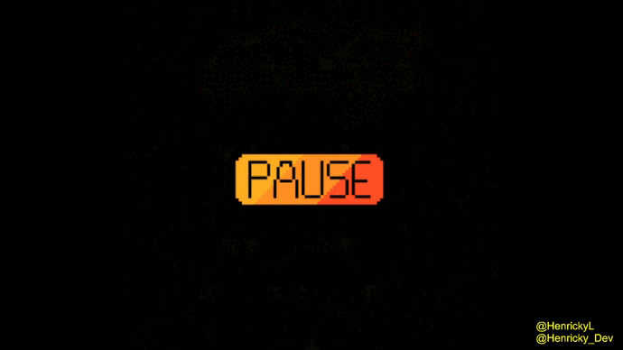
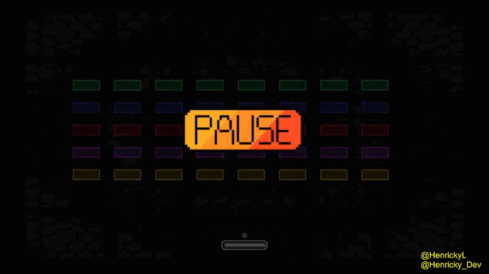
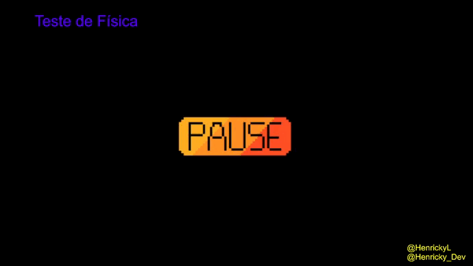

# 2D Game Engine cpp

* Engine

* Direct3D - Sprites

* Ai Module
  * Agent & Environment (To do)
  * [SearchMethods](https://github.com/HenrickyL/game-engine-2d-cpp/blob/17-ai-initial/DXUT/DXUT/SearchMethods.h) State-Transitions

Reference: [Programação de Jogos](https://www.youtube.com/watch?v=EuQyOyN6keA&list=PLX6Nyaq0ebfjfo4PlkAcKRxR66qXZk899) - [Prof. Judson Santiago](https://www.linkedin.com/in/judson-santiago-bb83661b2/)

--------------------

## Some examples
###  Initial Sprite with Frog game

### Colision

#### Galaga

#### Breakout

## Documentation

- [How to create your problem for A*](DXUT/DXUT/HowToCreateYourProblemAStar.md)

Reference: [Programação de Jogos](https://www.youtube.com/watch?v=EuQyOyN6keA&list=PLX6Nyaq0ebfjfo4PlkAcKRxR66qXZk899) - [Prof. Judson Santiago](https://www.linkedin.com/in/judson-santiago-bb83661b2/)

### Physics

